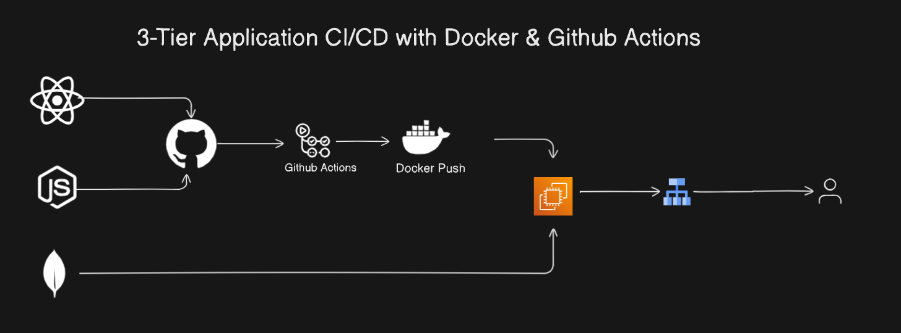

# 3-Tier Application CI/CD Pipeline with Docker and GitHub Actions

## Overview
This project demonstrates a **3-tier application CI/CD pipeline** implemented using **Docker** and **GitHub Actions**. The pipeline automates code changes, triggering builds, tests, and deployments into Docker containers. These containers are then deployed to an **EC2 instance**, ensuring a seamless and efficient delivery process for modern applications.

---

## Key Features
- **Code Integration:** Automatically triggers builds and tests upon code changes in the GitHub repository.
- **Containerization:** Applications are containerized using **Docker** for consistent and scalable deployments.
- **Continuous Deployment:** The final Docker image is pushed to an EC2 instance for production.
- **End-to-End Automation:** Fully automated pipeline from code commit to deployment.

---

## Architecture
1. **Development:** Developers push code changes to the GitHub repository.
2. **CI/CD Trigger:** GitHub Actions triggers the pipeline.
   - **Build Stage:** Builds a Docker image from the latest code.
   - **Test Stage:** Runs unit and integration tests on the container.
   - **Deploy Stage:** Pushes the Docker container to an EC2 instance.
3. **Deployment:** Dockerized application runs on the EC2 instance, ready to serve users.

---

## Prerequisites
1. **Docker Installed**: Ensure Docker is installed on your local system.
2. **AWS EC2 Instance**: Launch an EC2 instance with the necessary configurations.
3. **GitHub Repository**: Fork or clone the repository to work locally.
4. **GitHub Actions Setup**: Configure secrets for AWS access keys and EC2 details in your repository settings.

---

 
## CI/CD Pipeline Details
1. **Build:**
   - Creates a Docker image using the Dockerfile.
   - Ensures the image meets quality and security standards.

2. **Test:**
   - Runs all unit and integration tests within the container.
   - Outputs test results to the pipeline logs.

3. **Deploy:**
   - Connects to the EC2 instance using SSH.
   - Pulls the Docker image and runs the container in production.

---

## How to Star the Repository
If you find this project helpful, please star the repository on GitHub to show your support:
1. Click the ⭐ button in the top-right corner.

---

## Author
**Jibran**  
Passionate DevOps Engineer and Software Developer.
Connect with me on [LinkedIn](https://www.linkedin.com/in/muhammad-jibran220/).

---
 

## Feedback & Contributions
Contributions are welcome! Feel free to fork the repository and submit a pull request.

---

 